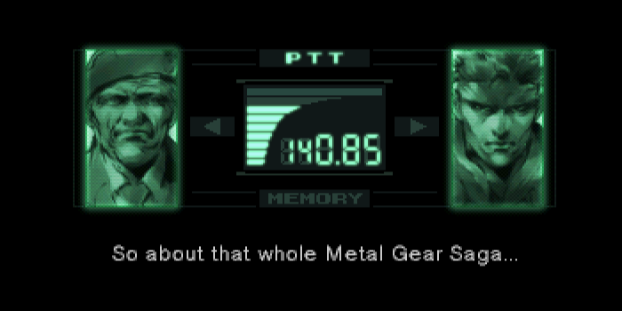

# Metal Gear Timeline

  <kbd>
    
  </kbd>

Mechs with nuclear missiles, espionage and... snakes. Unfolding over 50 years, this great Japanese epic was created in the mind of the nerd and cinephile **Hideo Kojima**, who poured his eccentricities onto the pages of the script, and then molded them into one of the most recognizable gaming franchises in the world – **Metal Gear**!

#

– *Snake. What was she fighting for? What am I fighting for? What are you fighting for?*

– *If we make it through this I'll tell you.*

– *Okay. I'll be searching too.*
